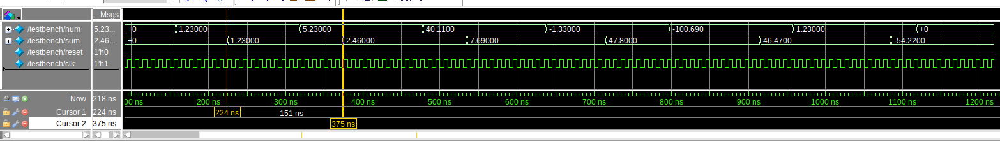

# Тестовое Задание:

Возьми любую открытую библиотеку, реализующую floating point арифметику на Verilog или System Verilog, и

- покажи, как ей пользоваться: напиши модуль на System Verilog, складывающий два числа типа float32.
- задача со звездочкой: с помощью найденной тобой библиотеки напиши модуль на Verilog или System
Verilog, редуцирующий ряд из N вещественных чисел, где N достаточно большое, в одно число -- сумму
ряда. Как добиться минимальной утилизации аппаратных ресурсов при решении данной задачи? На
каком такте твоего решения ответ будет корректным?
Ты можешь не выполнить тестовое задание целиком, или выполнить лишь частично. Но любые комментарии
к твоему решению будут тебе плюсом.

# Решение

Для решения была взята библиотека https://github.com/dawsonjon/fpu, а именно модуль сложения чисел IEEE 754 float32 `adder/adder.v`.

Интерфейс модуля описан [на официальной странице](http://dawsonjon.github.io/Chips-2.0/.language_reference/interface.html).


Для упрощения интегрирования, интерфейсные сигналы модуля были инициализированы подтверждающими значениями: `_stb` сигналы валидности данных привязаны к `1`. Используя этот сумматор, был собран модуль сложения чисел ряда:
```sv
module reducer
(
    input logic clk,
    input logic reset,
    input logic [31:0] num_i,
    output logic [31:0] sum_o
);
```

На вход подаётся одно число ряда, на выходе формируется сумма чисел. Задержка сложения составляет 15 тактов.

Для проверки модуля был написан testbench.sv, результат запуска которого показан на рисунке ниже.



Его можно запустить при помощи команды:

```bash
make
```

Собранный модуль был просинтезирован при помощи Yosys для получения микроархитектурной диаграммы. Она представлена в файле `microarch.svg`.  

> Из-за различных задержек сложения, модуль иногда воспринимает число как два слагаемых. Это может быть исправлено пробросом и правильным интерпретированием внутреннего интерфейса.
