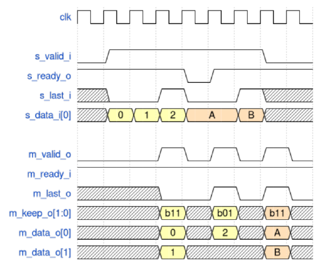
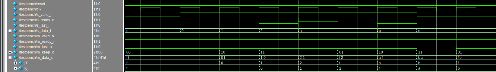

# Тестовое задание

## Этапы выполнения задания:
1. Проектирование. Результатом этапа является README, включающий:
- описание принятых при проектировании решений;
- (опционально) микроархитектурные диаграммы устройства;
- описание работы спроектированных модулей;

Нам важен в первую очередь ход ваших мыслей при проектировании блока.

2. Кодирование и bring-up тест.
Результатом данного этапа является:
- код на Verilog или System Verilog
- testbench и набор тестовых векторов для среды ModelSim
- (опционально) скрипт для запуска симулятора (Makefile или bash)

## Вариант 1. Потоковый апсайзер

На вход модуля поступают транзакции размерности данных `T_DATA_WIDTH`. Модуль должен выполнить их
преобразование в транзакции размерностью `T_DATA_RATIO*T_DATA_WIDTH`, где `T_DATA_RATIO` -
степень числа 2. В одном выходном пакете данных может быть передано несколько слов данных. Сигнал
m_keep_o представляет собой набор флагов валидности данных. Каждому слову сигнала `m_data_o`
соответствует 1 бит валидности сигнала `m_keep_o`. Если бит валидности слова равен 0, то такое слово
является "нулевым" - не несет полезной информации. Смешивать в одном выходном пакете данные разных
входных транзакций - **запрещено**.

Ниже приведен пример преобразования данных для конфигурации:
```sv
T_DATA_WIDTH_TEST = 4
T_DATA_RATIO_TEST = 2
```


В данном примере предполагается, что выходной пакет имеет `latency = 1`, но в вашем блоке `latency` может
быть равным 0.

# Решение

В основу положены сдвиговые регистры, размер которых зависит от `T_DATA_RATIO` - чем больше транзакция, тем глубже нужно хранить историю.

Флаги интерфейса вычиляются последовательностно с помощью счётчика `word_counter`.

> Пока есть проблема с вычиcлением m_last_o

Для проверки модуля был написан testbench.sv, результат запуска которого показан на рисунке ниже.



Его можно запустить при помощи команды:

```bash
make
```

Слова, не присутствующие в транзакции, заполняются F (для видмости, можно поставить и 0) и не попадают в соседнюю транзакцию.
